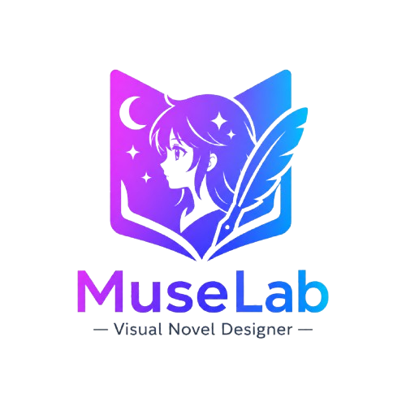
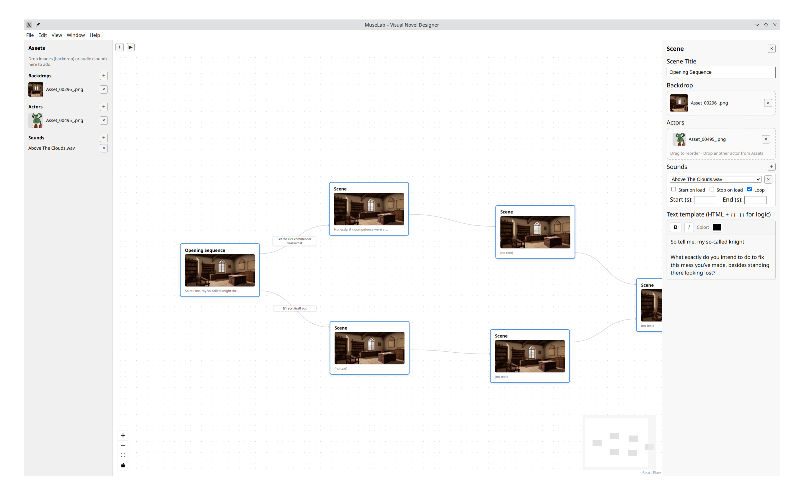
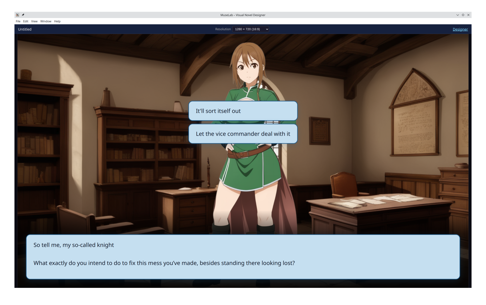

<p align="center">
  
</p>

Design and play branching visual novels in a node-based editor. Build scenes with backdrops, actors, sounds, and dynamic text templates, then test your story in the player.

Version 0.1

[muselab.softweyr.co.uk/app/v1/](https://muselab.softweyr.co.uk/app/v1/)

<p align="center">
  <a href="https://discord.gg/YpDgdyn9Je"></a>
</p>

*Copyright © 2025 MuseLab. Licensed under the MIT License.*

## Screenshots

**Designer** – Node-based flow editor with scene nodes, assets, and text templates.



**Player** – Visual novel–style play view with dialogue box, actors, and choices.



## Features

- **Flow-based designer** – Place scene nodes on a canvas and connect them. Add option text and conditions so players see different choices depending on the story state.
- **Rich scenes** – Each node can have a backdrop image, one or more actor images, sounds (with start/stop, loop, trim), and a text template for dialogue and narrative.
- **Text templates** – Embed **Cito** (Ć language) in `{{ expression }}` blocks and `{{#if condition}}...{{/if}}` for conditionals. Use `rt.GetString("key")`, `rt.SetBool(...)`, `rt.Emit(...)`, `rt.Call(...)`, `rt.PlaySound(...)`, and `Format.*` markup helpers. See [docs/cito-templates.md](docs/cito-templates.md).
- **Assets** – Add backdrops, actors, and sounds from your computer. In the desktop app, use the file picker; in the browser, drag and drop.
- **Player** – Run your story from the designer (Play button). The player shows your scenes with dialogue, choices, and branching based on conditions and state.
- **Locales** – Support multiple languages. Dialogue and choice labels are stored per locale (`prompts.<locale>.json` inside `.mlvn` archives). Switch locale in the player; edit visible locales in the project panel.
- **Multiple stories** – A project can contain several branching story graphs. Use the Stories panel to add, rename, and switch between them.
- **Save and load** – Save your project as a `.mlvn` file (a zip archive with manifest, locale prompts, and media). In the desktop app, use File → Save/Load; in the browser, use the project panel buttons (downloads/uploads the archive). Legacy plain `.json` projects can still be opened for migration. The app will prompt you to save before creating a new project or closing.
- **Offline (browser PWA)** – The deployed web app at `/app/` can be installed as a Progressive Web App. After one online visit, the app shell and Cito WASM are cached so you can keep editing offline; project data is auto-saved to localStorage and IndexedDB in the browser.

## How to Install

### Option 1: Run from source (web or desktop)

You need **Node.js 18 or newer** (and npm) installed. For template evaluation in the desktop app, you also need the **.NET 6 SDK** and the **cito** git submodule (`git submodule update --init --recursive`, then `npm run build:cito`).

1. Clone the repository and go into the project folder:
   ```bash
   git clone https://github.com/BEllis/MuseLab.git
   cd MuseLab
   ```
2. Install dependencies:
   ```bash
   npm install
   ```

You can then run MuseLab in the browser or as a desktop app (see [Getting Started](#getting-started)).

### Option 2: Use a built release (desktop)

If a desktop release is provided for your platform, download and run the installer or executable. No Node.js required.

## Getting Started

### Running the app

- **In the browser:** Run `npm run dev`, then open the URL shown (e.g. `http://localhost:5173`). Use the Designer to build your story and click **Play** to open the player. Offline/PWA caching is enabled only in the production web deploy (`npm run build:web-deploy`), not in dev mode.
- **Desktop app:** Run `npm run electron:dev`. Use **File → New / Save / Load** to manage project files.

### Creating your first story

1. **Open the Designer** – You start on the flow canvas. Click **Add scene** to create your first node.
2. **Add more scenes** – Create more nodes and connect them: drag from a node’s edge to another node to create a link.
3. **Edit a scene** – Select a node. In the side panel you can:
   - Set a **label** (for your reference).
   - Choose a **backdrop** image.
   - Add **actors** (character images). You can add multiple; they appear at the bottom of the play area.
   - Add **sounds** and set whether they start on load, loop, or trim to a time range.
   - Write the **text template** – your dialogue and narrative. Use Cito in `{{ }}` blocks, e.g. `{{ rt.GetString("name") }}`. See [docs/cito-templates.md](docs/cito-templates.md).
4. **Set up choices** – Select an edge (the line between two nodes). You can add **option text** (what the player sees, e.g. “Go left”) and an optional **Cito condition** (e.g. `rt.GetBool("hasKey")`) so the choice only appears when true.
5. **Add assets** – In the assets panel, add backdrops, actors, and sounds. Then assign them to your nodes.
6. **Play** – Click **Play** to open the player. The entry scene is the sole root node (no incoming edges), or the story’s designated `entryNodeId`. Click through dialogue and choices to test your story.

### Player tips

- In the player header you can change **Resolution** to see how your story looks at different sizes. Use **Custom** to enter a specific width and height.
- When there’s only one path forward and no choice text, the dialogue box shows **Continue >>**; you can also click anywhere on the dialogue to advance.
- Use **Designer** in the player header to return to the editor.

### File menu (desktop app)

- **New** (Ctrl/Cmd+N) – Start a new project. You’ll be prompted to save first if there are unsaved changes.
- **Save** (Ctrl/Cmd+S) – Save the project as a `.mlvn` file.
- **Load** (Ctrl/Cmd+O) – Open a saved `.mlvn` project (or legacy `.json` for migration).
- **Quit** – Close the app.

## License

Copyright © 2025 MuseLab. Licensed under the MIT License. See [LICENSE](LICENSE) for the full text.

## For developers

If you want to contribute or work on the codebase, see [CONTRIBUTING.md](CONTRIBUTING.md) for the tech stack, project layout, and development commands.
