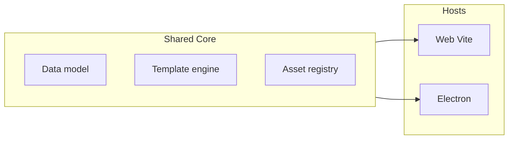

# Visual Novel Designer – Node.js/TypeScript (Web + Electron)

**Original plan.** Preserved for reference and version control.

> **Note:** This document describes the initial design (2025). The implementation has since evolved: projects use a `stories[]` model with per-locale `prompts.<locale>.json` files, Cito templates (not a JS sandbox), `.mlvn` zip archives, and additional features (undo/redo, themes, multi-story). See [PROJECT_STATUS.md](./PROJECT_STATUS.md) and [README.md](../README.md) for the current state.

---

## High-level architecture

- **Monorepo** with shared core + two entry points: **Web** (Vite + browser) and **Desktop** (Electron with same Vite app as renderer). One codebase, one UI, different host and asset handling.
- **Designer**: flow-graph editor (nodes = story elements, edges = links/options). Per-node: backdrop, actors, sounds, rich text template. Edges can carry option text and conditions.
- **Runtime/Player**: same app in "Play" mode (or separate build) loads the project, evaluates templates and conditions, and renders the current node with assets and choices.

---

## 1. Project structure and stack

- **Package manager**: pnpm (or npm) with a single root package and workspaces if you later split `packages/core`, `packages/editor`, etc. For a first version, a single package is fine.
- **Language**: TypeScript throughout (strict).
- **UI**: React 18+ with a single design system used in both Web and Electron.
- **Build**:
  - **Web**: Vite (React + TS). Dev server + static build.
  - **Electron**: Same Vite app as renderer; main process in TS (compiled or ts-node). Use `vite-plugin-electron` (or similar) so one `npm run dev` can run Electron with HMR.
- **Bundling**: Single Vite config that builds the React app; Electron main loads the built (or dev) index. No duplicate UI code.

Suggested root layout:

- `src/` – React app (designer + player views, components, state).
- `src/core/` – Data model, template engine, condition evaluation, asset registry (no DOM/Electron APIs).
- `electron/` – Main process (window, menu, file dialogs, optional native modules).
- `public/` – Static assets.

---

## 2. Data model (core)

Define in `src/core/model/` (or similar) and use from both designer and player.

- **Project**: `name`, `assets`, `nodes`, `edges`, `globalState` (or initial state seed).
- **Node (element)**:
  - `id`, `position` (x, y for layout), `label` (optional short name).
  - `backdropId: string | null` (optional single backdrop).
  - `actorIds: string[]` (zero or more actors).
  - `soundConfigs: Array<{ assetId, startOnLoad?, stopOnLoad?, loop?, startTime?, endTime? }>`.
  - `textTemplate: string` (see below).
- **Edge (link)**:
  - `sourceNodeId`, `targetNodeId`.
  - `optionText?: string` (if set, shown as player choice).
  - `condition?: string` (TypeScript expression, evaluated at runtime; if falsy, option hidden or link disabled).
- **Assets**: `id`, `type` (`backdrop` | `actor` | `sound`), `name`, `path` or `url` (and/or blob ref for web). Store in `project.assets`; designer and player resolve by `id`.

Keep the model serializable (plain JSON) so you can save/load projects and later add export for a standalone player if needed.

---

## 3. Flow editor (designer UI)

- **Library**: **AntV X6** (x6.antv.antgroup.com) – draggable nodes, connectable edges, minimap, pan/zoom. Fits "elements linked to each other" and "links with labels and conditions" (edge labels + data).
- **Custom node**: One node type for "story element" via `@antv/x6-react-shape`. Node body shows: short label, maybe first line of text; editor panel for backdrop/actors/sounds and full text template.
- **Edges**: Native X6 edges with boundary connection points, smooth connector, and built-in labels for option text. Store `condition` in edge data in the project model.
- **State**: Zustand project store is the source of truth; `FlowCanvas` syncs project nodes/edges to the X6 graph imperatively.

You'll need a clear mapping: **X6 cell** ↔ **core model node/edge**. Keep IDs consistent; position lives on the node in the model for persistence.

---

## 4. Text content and templates

- **Storage**: Store raw template string per node (e.g. `textTemplate`). Allow basic HTML for styling: `<b>`, `<i>`, `
`, `
` (sanitize on render to avoid XSS; allow only these tags).
- **Template engine**: "TypeScript" in templates means small expressions or statements executed in a controlled environment:
  - **Option A (recommended for security)**: Use a **sandboxed evaluator** – e.g. `isolated-vm`, or a tiny DSL that compiles to safe JS (subset of TS expressions). Expose a fixed API: e.g. `state`, `setState(path, value)`, `emit(eventName)`, `call(name, ...args)`. No full `require` or DOM.
  - **Option B**: Full `Function()` or `vm` with a strict context – simpler but riskier; only for fully trusted/local use.
- **Template syntax**: Either **mustache/Handlebars-style** with helpers that run TS, or **tagged template / custom delimiters** (e.g. `{{ expr }}` for conditionals, `{{ set('x', true) }}` for updates). Example idea:
  - "Show if x": `{{#if state.x}}...{{/if}}` with `if` implemented via the sandbox.
  - "Update y": `{{ setState('y', 1) }}` (side effect when node is entered).
  - "Call function Z / emit Q": `{{ call('Z') }}` or `{{ emit('Q') }}` – implementation maps to your runtime registry.
- **Rendering**: Server-side or in-renderer: run the template once (or on state change) to get the final HTML string, then sanitize and render (e.g. `dangerouslySetInnerHTML` with a allowlist or a small sanitizer library). Styling is then the allowed HTML tags.

Implement the engine in `src/core/template/` and keep it dependency-free from React/Electron so it's easy to test and reuse in a future standalone player.

---

## 5. Links as options and conditions

- **Option text**: Stored on the edge (`optionText`). In the player, when the current node has out-edges with `optionText`, render them as clickable choices; when none, you might auto-advance (e.g. first link) or show "Continue".
- **Conditions**: Store `condition` (string) on the edge. At runtime, evaluate in the same sandbox as templates, with read-only (or controlled) access to `state`. Hide or disable options whose condition is false. Use the same security approach as for templates (sandbox or DSL).

---

## 6. Assets (images and sounds)

- **Types**: Backdrops (images), Actors (images/sprites), Sounds (audio).
- **Model**: As above – `project.assets[]` with `id`, `type`, `name`, and a **path** (file path for Electron) or **url/blob** (for web uploads).
- **Web**: "Add" = file input → read as `File`, optionally create object URL or upload to a small local asset server; store in project as `url` or base64 (or external URL). "Upload" can mean the same or a real server; for offline-first, store blob URLs or base64 in project JSON.
- **Electron**: "Add" = open file dialog (main process) → copy file to project folder (e.g. `projectDir/assets/<id>.<ext>`) and store relative path; renderer loads via `file://` or via a protocol handler (e.g. `asset://id` → main resolves and streams). Same model (`path` or `url`) so the rest of the app is identical.
- **Sound options**: On the node, store `soundConfigs` with `startOnLoad`, `stopOnLoad`, `loop`, `startTime`, `endTime`. Player, when entering the node: for each sound, start/stop per config; when text invokes a sound (e.g. `{{ playSound('id') }}`), start with optional start/end. Use HTML5 `Audio` in both Web and Electron; in Electron you can use the same or a minimal native API if needed.

Implement an **asset resolver** in `src/core/assets` that, given `assetId` and environment (web vs Electron), returns a URL or path the UI can use for `` / `<audio>`.

---

## 7. Player / runtime

- **State**: A single state object (e.g. `state: Record<string, unknown>`) initialized from `project.globalState`. Updated by template actions (`setState`, `call`, `emit`).
- **Flow**: Start at an "entry" node (e.g. first node or a designated id). On enter: load backdrop, place actors, apply sound configs, evaluate text template, render HTML. On "Continue" or choice: evaluate conditions on out-edges, show only valid options; on click, transition to target node and repeat.
- **Events**: `emit('Q')` can be used for analytics, side effects, or triggering custom logic (e.g. achievements). Implement a small event bus in core and subscribe in the player view.

You can implement the player as a separate route or view in the same app (e.g. `/play` or a "Play" mode) that loads the current project and runs the engine.

---

## 8. Implementation order (suggested)

1. **Scaffold**: Vite + React + TypeScript; add Electron with one window loading the app. No flow yet.
2. **Core model**: Types and in-memory project (nodes, edges, assets). Save/load JSON (e.g. from localStorage for web; from dialog in Electron).
3. **AntV X6**: Integrate X6 graph; custom React node shape that read/write the core model. Persist positions.
4. **Node editor**: Per-node form for backdrop, actors, sounds (dropdowns by asset id), and text template (textarea). Wire sound options (start/stop/loop/startTime/endTime).
5. **Edge editor**: Option text and condition (textarea or inline). Show option text on edge label in the graph.
6. **Template engine**: Sandbox (or DSL) + small API (`state`, `setState`, `emit`, `call`). Sanitized HTML output. Use in a simple "preview" first (single node).
7. **Asset layer**: Asset registry + resolver; file picker in Electron (main process); file input in Web; same UI for "add asset" in both.
8. **Player**: Single-node then multi-node navigation; conditions on edges; choices; sound playback from config and from template.
9. **Polish**: Drag-and-drop asset upload, validation, and "start/stop on load" and "invoke from text" for sounds.

---

## 9. Key files to add (conceptual)

| Area        | Files                                                                            |
| ----------- | -------------------------------------------------------------------------------- |
| Core model  | `src/core/model/project.ts`, `types.ts`                                          |
| Template    | `src/core/template/engine.ts`, `sandbox.ts` (or `dsl.ts`)                        |
| Assets      | `src/core/assets/resolver.ts`, `registry.ts`                                     |
| Flow editor | `src/components/FlowCanvas.tsx`, `StoryNode.tsx`, `src/x6/` |
| Node form   | `src/components/NodeEditor/BackdropActorSoundForm.tsx`, `TextTemplateEditor.tsx` |
| Player      | `src/views/PlayerView.tsx`, `src/core/runtime/runner.ts`                         |
| Electron    | `electron/main.ts`, preload if needed for file dialogs                           |

---

## 10. Security and safety

- **Templates and conditions**: Run only in a sandbox or via a strict DSL; never `eval` or full `Function` on untrusted input. If the project is always local and trusted, you can relax later with a clear warning.
- **HTML**: Sanitize template output (allowlist `<b>`, `<i>`, `
`, `
`) before rendering to avoid XSS.
- **Electron**: Disable Node in renderer if you don't need it; use contextBridge for file/asset access. Preload only what's necessary.

---

## Summary

- One **Node.js/TypeScript** app: **React** UI + **Vite** for Web and Electron renderer; **shared core** for model, template engine, assets, and runtime.
- **Designer**: **AntV X6** for draggable, linkable elements; per-node backdrop/actors/sounds and **text template** with TS-like logic and basic HTML; edges with **option text** and **conditions**.
- **Text**: Template engine with **sandboxed** TS (or DSL), exposing **state**, **setState**, **call**, **emit**; render **sanitized** HTML.
- **Assets**: Unified **asset registry**; Web = file input/upload + URL or blob in project; Electron = file dialog + project folder and **asset resolver**.
- **Player**: Same app; run from project JSON with state, template evaluation, and conditional options; sounds from node config and from template.

This gives you a single codebase that runs on Web and Desktop, with a clear path from "designer" to "play" and room to add export or a standalone player later.
